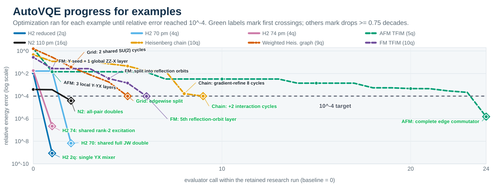

# AutoVQE

<div align="center">
  <h2>AutoVQE Progress for Examples</h2>
  
</div>

AutoVQE is inspired by Andrej Karpathy's
[autoresearch](https://github.com/karpathy/autoresearch), adapting its idea to VQE ansatz discovery. Finding the appropriate ansatz is a tedious task that requires a lot of trial and error. AutoVQE focuses on solving this problem. Given a Pauli Hamiltonian, your agents edits ansatz, runs an experiment, learns, improve, and repeats.

The repository is intentionally compact. Its main files are:

- `program.md` defines the research loop, physical guidance, and anti-cheating
  boundary.
- `ansatz.py` is the agent's laboratory notebook and the only code it edits.
- `evaluate.py` is the fixed experiment: optimization, energy, and transparent
  transpiled resource accounting.

`examples/` contains Hamiltonians used in our experiments, which you can also
run yourself.

## Quick start

Install Python 3.10+ and [`uv`](https://docs.astral.sh/uv/), then:

```bash
uv sync
```

Start a fresh Codex task in this repository:

```text
Create a goal to read program.md and optimize examples/h2_4q_bond_70pm.json.
Use the evaluator's default time for every candidate and continue the
keep/discard research loop until I interrupt you. Do not stop at convergence,
a plateau, or target_reached=true. Before target, improve energy; after target,
preserve the requested accuracy and simplify current_best.
```

Replace the path or candidate budget as needed. The agent establishes the baseline and
follows the closed loop and anti-cheating boundary in `program.md`.

## Evaluator

To evaluate one candidate manually:

```bash
uv run python evaluate.py path/to/hamiltonian.json --hypothesis "baseline"
```

Each run appends its `keep` or `discard` decision to ignored `results.tsv`. The
evaluator keeps one ignored `current_best` circuit-and-parameter checkpoint per
problem, warm-starts matching parameters, and restores `ansatz.py` after a
discard. Delete `results.tsv` and `.autovqe-state.json` for a fresh loop; use a
new clone for an independent one. `--restore-best` restores `current_best` after
an interrupted edit.

The per-candidate budget is `max(30, 60 * 2 ** (n - 16))` seconds for Hamiltonian
width `n`; override it with `--seconds`. There is no total research limit: the
loop ends when the user interrupts it. Parameterized candidates use the whole
budget; convergence triggers a deterministic restart. `L-BFGS-B` uses an adjoint
gradient. If `reference_energy` exists, `target_reached` means relative error at
most `1e-4` (0.01%) by default and starts simplification; adjust it with
`--target-relative-error`. Without a reference, AutoVQE reports only `best found`,
never a ground-state claim.

## Problem and ansatz formats

A problem is JSON with `pauli_terms` and optional `initial_state_hint`,
`basis_gates`, `coupling_map`, and `reference_energy`. Pauli labels use Qiskit
ordering: the rightmost letter acts on qubit 0; `initial_state_hint[i]` is qubit
`i`. See `examples/` for complete inputs.

An ansatz operation in `ansatz.py` is:

```python
("YX", (0, 1), "theta", 1.0)
("U1", (0, 1), "exchange", 1.0)  # XX + YY
("GIVENS", (0, 1), "mix", 1.0)   # (YX - XY) / 2
("PAIR", (0, 1), "pair", 1.0)    # (YX + XY) / 2
("SU2", (2, 3), "spin", 1.0)     # XX + YY + ZZ
```

This applies `Y` to qubit 0 and `X` to qubit 1. Direct words contain only active
`X/Y/Z` letters in qubit-tuple order; omit identity positions. The last value
may be `-1`, `-0.5`, `0.5`, or `1`. Reusing a parameter name shares it.
`ansatz.py` is data-only: imports, functions, and executable expressions are
rejected. Every operation is expanded into one-qubit basis changes, `RZ`, and
`CX` before accounting; supplied basis and coupling constraints are used for
transpilation. Macros are charged for every component, so parameter sharing
does not hide cost. There are no opaque custom unitaries.
